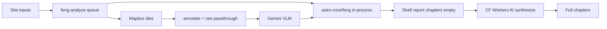

# Feng 报告质量优化计划

**Status:** proposed (2026-07-24)  
**Based on:** code audit of `feng-analyze` → `svc-feng` → `astro-core/feng` → feng-app report UI  
**Companion:** [pro-grade-plan.md](./pro-grade-plan.md), [acceptance-standard.md](./acceptance-standard.md), [optimization-progress.md](./optimization-progress.md)

---

## 1. 核查结论（现状）

### 已经够好 — 不要推倒重写

| 层 | 位置 | 为什么保留 |
|----|------|------------|
| 沈氏 deterministic | `packages/astro-core/src/feng/` | 飞星/格局/组合/八宅/形理 + golden harness |
| 编排 | `apps/hexastral-api/src/lib/feng-analyze.ts` | 队列、shell、购后 consume、失败清孤儿 |
| Vision 分路 | `svc-feng` Flash 形煞 + Pro 砂/水 | 成本与信号分离合理 |
| 合规 | `output-audit` + portfolio-voice | App Store / 禁符咒路径已铺 |
| 两阶段 UX | report shell → chapters | 盘面先可见，避免空白等待 |

### 质量差的主因（按 ROI）

1. **Vision 提示词与真实输入脱节**  
   [`prompts/vision.ts`](../../services/svc-feng/src/prompts/vision.ts) 仍写「图上有坐向箭头 / 八卦扇区」；[`annotate.ts`](../../services/svc-feng/src/routes/annotate.ts) 实际只透传 **raw 卫星图**（客户端才画 overlay）。模型按「标注」读方位 → 形煞/砂水方向系统性漂移。

2. **合成上下文过载 + 审计过浅**  
   整包 `visionJson` + `computeJson` 注入 prompt；[`synthesis-compute-audit.ts`](../../services/svc-feng/src/lib/synthesis-compute-audit.ts) 几乎只查房间名 / `*格`，不校验「巽宫山7向9」类事实。

3. **模型栈与 locale**  
   章节走 CF Workers AI（Llama → Kimi → Qwen → GLM）；en/ja 回退易中文污染。Vision 用 Gemini，合成不在同一质量档。

4. **峦头覆盖空洞**  
   公寓无街景形煞；flat-urban 常只有 close tile；无建年则 digest=null、飞星章删除，但其他章语气仍可能「权威」。

5. **缺少散文 eval**  
   [acceptance-standard.md](./acceptance-standard.md) 卡 deterministic 红旗，**不卡 LLM 正文**。

与 [pro-grade-plan.md](./pro-grade-plan.md) 自评一致：峦头 ~4/10、形理引擎已进线但散文层未吃透。

---

## 2. 优化原则

- **Compute 权威，LLM 只叙事** — 冲突以 compute / formLi 为准。
- **Vision 只报看见的** — 方位信 bearings / `formAzimuths`，不假装图上有标注。
- **少而准的 context** — 合成用 compact briefing，禁止整 dump。
- **可测才可改** — 每个 prompt / 模型变更配 fixture + 断言。

---

## 3. P0 — 对齐与止血（最大体感，优先做）

### A. Vision 输入契约重写

- 改 `services/svc-feng/src/prompts/vision.ts`：明确 **unannotated north-up satellite**；方位只信 user prompt 的 bearings / `formAzimuths` / 八卦宫文字表。
- 同步审查 `interior.ts`、street 内联 prompt。
- User prompt 显式附「宫 → 方位度数」一行。
- **不**急着重做 server-side resvg（已知 wasm 踩坑）。

### B. 合成 briefing 瘦身

- 在 `synthesize.ts` 增加 `buildSynthesisBriefing(compute, vision, locale)`：
  - 坐向/运盘身份、`patterns[]`、formLi 前 N 条、priority 宫 combinations、八宅 concord+placement、vision 摘要、`dataQuality.notes`
  - 默认不塞完整九宫原始盘
- 系统提示去重（合规已有 `portfolio-voice` block）。

### C. 合成事实审计加硬

- 扩展 audit：抽取正文 `山N向M` / 格局名 / 八卦宫，对照 `patterns` + `combinations` + `formLi`；违规则 retry 或打 metric。
- 保留现有 forbidden 符咒审计。

### D. 诚实 disclaimer

- apartment：强制「街景形煞未评估」。
- `flyingStarsConfidence !== high` / omitted：章首 / 概览强制 caveat。

### E. 文档纠偏

- 更新 `services/svc-feng/README.md`（去掉 stub 描述）。
- 本文件 + `optimization-progress.md` 记录完成项。

---

## 4. P1 — 模型与评测

### F. 合成模型策略

- zh：继续 CF 旗舰路由；监控 fallback 深度。
- en/ja：locale gate（检出中文污染即 retry）；评估 Gemini 3.1 Pro 专跑非中文合成。
- 超时：倾向 **按章持久化 partial**，避免整单失败删 shell（需产品确认）。

### G. Vision 成本路径

- 形煞：维持 Flash。
- 砂/水：复核「无形煞则跳过 form」是否误伤「有水无煞」。
- Street：缺 token 时报告内可见 degraded。

### H. 散文 eval harness

- 5–8 个 golden site（录制 vision JSON + 固定 compute）。
- 断言：每章 ≥2 个宫+星引用；forbidden=0；格局名 ⊆ compute；locale 字符集。
- CI mock LLM 跑 audit；人工 `bun feng:samples` 扩展。

---

## 5. P2 — 峦头与体验

- 继续 closeout：水系按宫、DEM 朝案几何审计。
- 公寓产品文案：降低「外局很准」期待。
- 客户端：`deriveReportDigest` 传入 `visionShaCount`；无 mid/wide 时禁止写未观测远景。
- 可选：synthesis 注入 top-N `feng-terms` 定义（仅 locale 齐全条目）。

### 明确不做

- 推倒沈氏引擎 / 换血统。
- 外部风水师签收（已锁定 acceptance-standard）。
- 未验证前重做 server 栅格标注。

---

## 6. 落地顺序与成功标准

| 周 | 交付 |
|----|------|
| W1 | P0-A Vision prompt 契约 + 3 站点手工 A/B |
| W1–2 | P0-B/C briefing + 硬审计 + disclaimer |
| W2 | P0-E 文档；P1-H fixture 骨架 |
| W3 | P1-F locale/模型门控 + 指标 |
| 之后 | P2 |

**成功标准**

- Vision：方向类错误明显下降（目标减半）。
- 合成：audit fail ↓；en/ja 中文污染 ≈ 0。
- 体感：概览 + 飞星/命卦章能对上盘面数字；外峦头不再编远景。
- Job：synthesis timeout 失败率 ↓，或改为 partial 可读。

---

## 7. 关键文件索引

| 关注点 | 路径 |
|--------|------|
| 编排 | `apps/hexastral-api/src/lib/feng-analyze.ts` |
| Vision 路由 / 提示 | `services/svc-feng/src/routes/vision.ts`, `prompts/vision.ts` |
| Annotate | `services/svc-feng/src/routes/annotate.ts` |
| 合成 | `services/svc-feng/src/routes/synthesize.ts`, `prompts/synthesis.ts` |
| 审计 | `services/svc-feng/src/lib/synthesis-compute-audit.ts`, `output-audit.ts` |
| Digest | `packages/scenario-feng/src/lib/report-digest.ts` |
| 报告 UI | `apps/feng-app/app/(report)/[siteId].tsx` |
