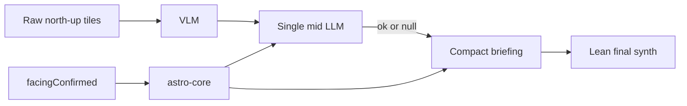

# Feng 报告质量优化计划

**Status:** active — **本波「别胡说」P0 已落地**（2026-07-26）；沈氏 `acceptance-standard` **本波零改动**  
**Based on:** code audit of `feng-analyze` → `svc-feng` → `astro-core/feng` → feng-app report UI  
**Companion:** [pro-grade-plan.md](./pro-grade-plan.md), [acceptance-standard.md](./acceptance-standard.md), [optimization-progress.md](./optimization-progress.md)

> **本波提高的是管线诚实与散文纪律，不是沈氏盘面正确性，也不是「带罗盘上门」完整体感。**  
> Submit gate: prose/honesty P0 below should be green before App Review. Publish matrix: [docs/publish/README.md](../../publish/README.md).

---

## 0. 重构优先级（本波已完成项）

1. ✅ **Vision prompt 契约** — unannotated north-up；方位只信 bearings / `formAzimuths` / 宫→° 表  
2. ✅ **`readingPublic`** — classical `reading` 仅内部；对外 / 中段 / 终章 / UI chips 只用 public  
3. ✅ **`buildSynthesisBriefing` + 可变章节** — ≤12k chars；无飞星则省略飞星章；`maxTokens ≤ 8192`  
4. ✅ **单次中段 `form_li`** — Zod + 硬审计 + fail-open（不因中段失败退款）  
5. ✅ **强制 caveat + `facingConfirmed` 硬闸**  

明确不要（仍成立）：推倒 `astro-core/feng`、重做 server-side resvg、本波分路多次中段、改 `acceptance-standard.md`。

---

## 1. 核查结论（历史背景）

```mermaid
flowchart LR
  facingGate[facingConfirmed] --> compute[astro-core]
  tiles[Raw north-up tiles] --> vision[VLM]
  vision --> formLi[Single mid LLM]
  compute --> formLi
  formLi -->|ok or null| briefing[Compact briefing]
  compute --> briefing
  briefing --> synth[Lean final synth]
```

### 已经够好 — 不要推倒重写

| 层 | 位置 | 为什么保留 |
|----|------|------------|
| 沈氏 deterministic | `packages/astro-core/src/feng/` | 飞星/格局/组合/八宅/形理 + golden harness |
| 编排 | `apps/hexastral-api/src/lib/feng-analyze.ts` | 队列、shell、form_li、购后 consume |
| Vision 分路 | `svc-feng` Flash 形煞 + Pro 砂/水 | 成本与信号分离合理 |
| 合规 | `output-audit` + portfolio-voice + readingPublic | App Store / 禁符咒 / medical denylist |
| 两阶段 UX | report shell → chapters | 盘面先可见；中段 fail-open 不挡壳 |

### 本波已止血的主因

1. Vision 不再假装图上有箭头/八卦环（fixture 断言）  
2. 合成不再 dump 整包 vision/compute；硬审计 `山N向M` / 格局 / medical  
3. 公寓街景缺口 + 飞星置信度非高 → **封面强制 caveat**（不靠 LLM）  
4. 未 `facingConfirmed` → analyze enqueue **4xx**

仍属下波 / Wave 2：罗盘立极仪式 UX、地图客户端叠层、DEM 水口/水系按宫、散文 eval harness、en/ja locale gate。

**峦头方位：** Tilequery `formAzimuths` = 水/路方位 SSOT；VLM 负责水型形貌；DEM contour = 砂/来龙（非 Terrain-RGB）。

---

## 2. 优化原则

- **Compute 权威，LLM 只叙事** — 冲突以 compute / formLi 为准。  
- **Vision 只报看见的** — 方位信 bearings / `formAzimuths`，不假装图上有标注。  
- **少而准的 context** — 合成用 compact briefing，禁止整 dump。  
- **中段是增益** — fail-open 必出瘦终章。  
- **可测才可改** — §5.2 门槛见 [optimization-progress.md](./optimization-progress.md) 本波表。

---

## 3. P0 — 对齐与止血（本波勾选）

### A. Vision 输入契约重写 ✅

- `services/svc-feng/src/prompts/vision.ts` + `vision.test.ts`

### B. 合成 briefing 瘦身 ✅

- `services/svc-feng/src/lib/synthesis-briefing.ts` + tests

### C. 合成 / 中段事实审计加硬 ✅

- `form-li-notes-audit.ts` + `synthesis-compute-audit.ts`

### D. 诚实 disclaimer ✅

- `forcedCoverCaveats` in feng-app + i18n keys

### E. 文档纠偏 ✅

- `services/svc-feng/README.md`；本文件；`optimization-progress.md`  
- **明示：本波不提高沈氏正确性，不改 acceptance-standard**

---

## 4. P1 — 模型与评测（下波）

### F. 合成模型策略 / locale gate

### G. 散文 eval harness + 方向错误率自动测

### H. 分路中段（硬触发：上线 ≥2 周且 `feng.mid_llm.fail_open` >15% 或终章 audit 违规 >10%）

---

## 5. 成功标准（给人看的一句话）

**工程师：** Vision / briefing / mid+final audit / readingPublic / facing 闸单测全绿。  
**产品：** 没立极不出报告；缺口写在封面上；峦头先记一笔再成章；盘面数字对得上——而不是「AI 风水大师上门了」。
