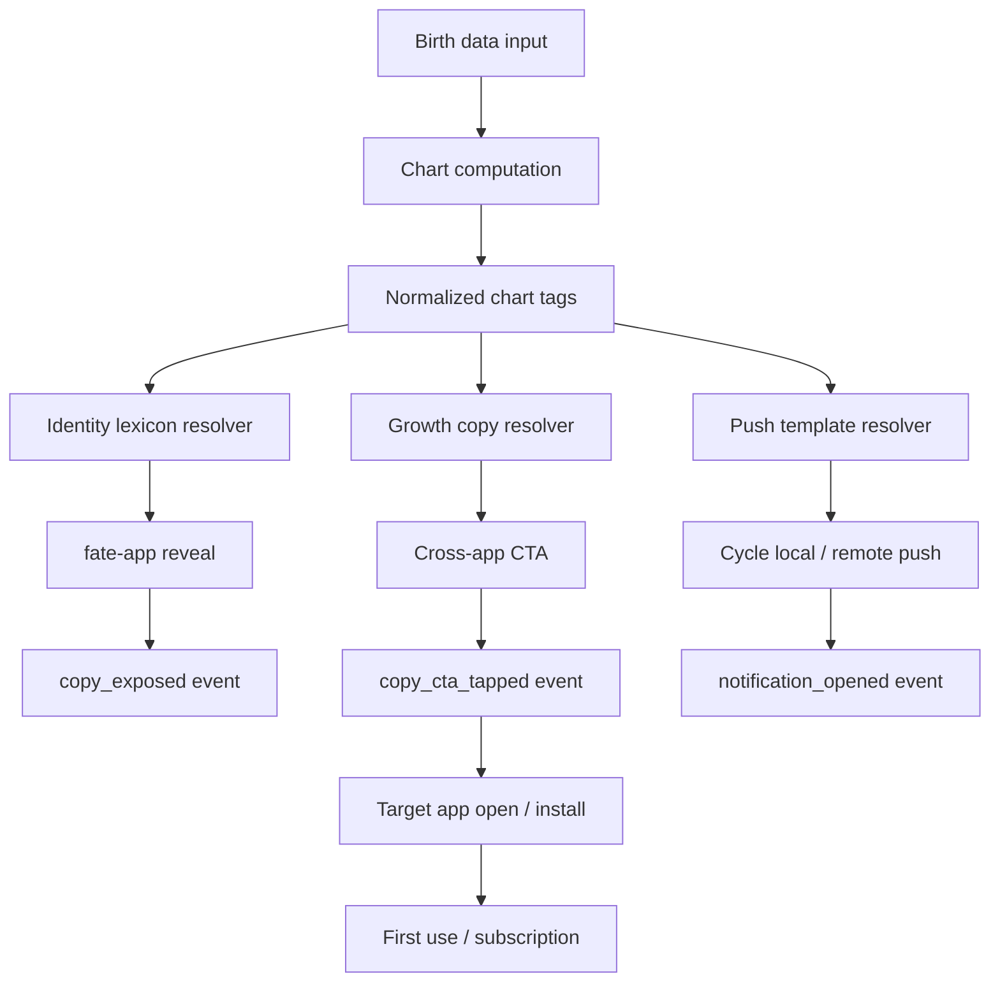

# Birth Lexicon System Plan

> **Status**: Proposal v1  
> **Created**: 2026-05-29  
> **Scope**: birth-data apps, fate-app onboarding, Cycle conversion, Yuan/Feng handoff copy, push copy, A/B testing, D1 seed workflow  
> **Primary decision**: `fate-app` is the birth-data funnel and identity capture surface. `cycle-app` becomes the daily-entry flagship and subscription surface.

## 0. Executive Summary

The词库系统 should not be a single table of "fortune words". It should become a small growth infrastructure layer:

1. **Deterministic chart facts** produce stable tags from birth data.
2. **Identity lexicon** explains "who I am" in `fate-app`.
3. **Growth copy variants** test which framing converts users into `cycle-app`, `yuan-app`, or `feng-app`.
4. **Push templates** reuse the same framing, but the day/event facts come from deterministic almanac logic.
5. **Funnel events** attribute exposure, tap, app open, push opt-in, first use, and subscription.

The product split should be:

| App | Role | Core job | Cost posture |
|---|---|---|---|
| `fate-app` | Funnel / identity entry | Capture birth data, reveal basic structure, route intent to flagship apps | Pure compute + preset词库 by default. No expensive runtime LLM for free traffic. |
| `cycle-app` | Daily flagship | Calendar, 黄历, personalized day planning, reminders, Pro subscription | Deterministic daily layer is free. Pro deep planning / long window / saved schedules / chat can use guarded LLM. |
| `yuan-app` | Relationship depth | Relationship / compatibility / bond timeline | Receives users when copy detects relationship intent. |
| `feng-app` | Space / career / home depth | Site, direction, home/office planning | Receives users when copy detects space / move / career intent. |

The most important architecture decision is to **separate content that explains the chart from content that sells the next action**. The current `archetype_presets` table is useful as the first layer, but it is not enough for conversion experiments.

## 1. Current Repo Facts

This section records what is true in the repository as of 2026-05-29.

### 1.1 Existing DB Tables

The current schema already contains two词库-like tables in [apps/hexastral-api/src/db/schema.ts](../apps/hexastral-api/src/db/schema.ts):

| Table | Current purpose | Key fields | Recommended future role |
|---|---|---|---|
| `archetype_presets` | 落地页 / onboarding 命格预设 | `day_stem`, `month_branch`, `gender`, `lang`, `bullet_1..3`, `fate_tease`, `warning`, `variant`, `impressions`, `conversions`, `active` | Keep as identity reveal control layer. Do not overload it for cross-app growth copy. |
| `chart_glossary` | 命盘术语长释义 | `key`, `category`, `lang`, `title`, `body_md`, `variant`, `active` | Keep as education / glossary. Do not use it for CTA tests. |
| `users` | User profile and derived birth tags | `birth_solar_date`, `birth_time_index`, `birth_gender`, `day_master_stem`, `day_master_strength`, `favorable_element`, `unfavorable_element`, `ziwei_ming_palace_star`, `birth_branch` | Source of durable user-level chart tags after sign-in or portfolio memory. |

The initial migration [apps/hexastral-api/migrations/0000_known_eternity.sql](../apps/hexastral-api/migrations/0000_known_eternity.sql) creates both `archetype_presets` and `chart_glossary`.

### 1.2 Existing Seed Data

Local seed file:

```text
apps/hexastral-api/scripts/archetype-presets.json
```

Current count:

| Scope | Count |
|---|---:|
| Total rows | 960 |
| `zh` | 240 |
| `zh-Hant` | 240 |
| `en` | 240 |
| `ja` | 240 |
| Variants | `A` only |

The 240 rows per language come from:

```text
10 day stems × 12 month branches × 2 genders = 240
```

Current English QA:

| Check | Result |
|---|---|
| English rows | 240 |
| `bullet_1` unique values | 10 |
| `bullet_2` unique values | 10 |
| `bullet_3` unique values | 12 |
| `fate_tease` unique values | 10 |
| `warning` unique values | 10 |
| Variants | `A` only |
| Gender differentiation | Male/female copy is currently identical in English |

Conclusion:

- The current English is fluent enough to serve as a **poetic identity control**.
- It is not enough for conversion testing because it only tests one voice, one intent, and one target.
- The text is abstract, premium, and suspense-oriented. That is good for first reveal, but weak for "what should I do next?"
- It should not be treated as 240 fully unique English messages. Effective semantic diversity is closer to `10 stems + 12 month-branch modifiers`.

### 1.3 Current Runtime Behavior

Current helper:

```text
apps/hexastral-api/src/lib/archetype-query.ts
```

It queries only:

```text
active = true
variant = 'A'
```

Current conversion endpoint:

```text
apps/hexastral-api/src/routes/onboarding/convert.ts
```

It also increments conversions only for:

```text
variant = 'A'
```

Therefore, the repository has the table fields for variants, but the actual product currently behaves like a single-control system.

### 1.4 Existing Funnel Event Package

The shared event schema is in:

```text
packages/growth-funnel/src/funnel-event.ts
```

Current event names include:

| Event | Use |
|---|---|
| `web_page_view` | Web visit |
| `web_cta_click` | Web CTA click |
| `ddl_session_created` | Deferred deep link session |
| `app_open` | Native app open |
| `app_install_attributed` | Install attribution |
| `first_reading_started` | First reading begins |
| `first_reading_completed` | First reading completes |
| `purchase_completed` | One-time purchase |
| `subscription_started` | Subscription |
| `portfolio_ddl_claimed` | App claimed DDL payload |
| `portfolio_apple_linked` | Sign in with Apple linked |
| `cross_app_discovery_tap` | Cross-app recommendation tap/open/fallback |

`cross_app_discovery_tap` currently has:

```text
source_app
target_app
action
via
```

It does **not** yet include:

```text
copy_id
experiment_id
variant
placement
target_intent
```

Those fields are required if we want to know which词库 wording actually caused conversion.

### 1.5 Remote D1 State Previously Checked

Remote database checked on 2026-05-29:

```text
database_name: hexastral-db
database_id: cad1ad88-5854-4a88-aa19-bc79e84f4c49
```

Observed remote row counts:

| Table | Remote rows |
|---|---:|
| `archetype_presets` | 0 |
| `chart_glossary` | 0 |
| `users` | 2 |
| `portfolio_readings` | 0 |
| `daily_signals` | 0 |
| `user_entitlements` | 0 |

Meaning:

- The tables exist remotely.
- The local archetype seed has not been inserted into remote D1 yet.
- No remote writes should happen until we explicitly decide seed quality and experiment structure.

Useful read-only check:

```bash
cd apps/hexastral-api
bun x wrangler d1 execute hexastral-db --remote --json --command "SELECT COUNT(*) AS cnt FROM archetype_presets;"
bun x wrangler d1 execute hexastral-db --remote --json --command "SELECT COUNT(*) AS cnt FROM chart_glossary;"
```

Seed command should remain approval-gated:

```bash
cd apps/hexastral-api
bun run scripts/seed-archetypes.ts --remote
```

## 2. Product Boundaries

### 2.1 Why `fate-app` Should Be The Funnel

`fate-app` has the strongest reason to ask for birth data. The user expectation is "tell me my structure", so birth data capture feels natural instead of invasive.

But `fate-app` is not ideal as the subscription flagship:

- It is lower frequency than a calendar.
- A birth chart has a "one-and-done" feeling unless extended into chat or forecasts.
- Runtime LLM cost can become high if every free user receives deep interpretation.
- Most users will not pay every month only to reread a static chart.

Therefore, `fate-app` should focus on:

1. Birth data capture.
2. Deterministic chart calculation.
3. Short identity reveal.
4. Conversion into the app that matches the user's intent.

### 2.2 Why `cycle-app` Should Be The Flagship

`cycle-app` can become a daily utility because it has repeatable jobs:

- What is today good for?
- What should I avoid today?
- Which day should I pick for this event?
- How does today's 黄历 interact with my chart?
- What should I schedule, delay, or prepare?

This supports a subscription better than `fate-app`:

| Free | Pro |
|---|---|
| Today / month 黄历 | Long-window 择日 |
| Basic personalized overlay | Detailed day planning |
| Local daily push | Saved plans and reminders |
| Limited search | Unlimited event planning |
| Deterministic explanation | LLM-assisted deep reading / chat |

`Cycle Pro` overlaps with the "daily forecasting" side of `fate-app`, so `fate-app` should not try to own that. `fate-app` owns identity; `cycle-app` owns daily action.

### 2.3 Whether This Conflicts With Fate Pro

It conflicts only if both apps sell the same promise.

Avoid conflict by assigning promises:

| Surface | Promise | Should include | Should avoid |
|---|---|---|---|
| `fate-app` | "Understand your structure." | birth chart, archetype, strengths, blind spots, app routing | daily calendar, long-term schedule planning, expensive free LLM |
| `cycle-app` | "Plan your day and events." | calendar, 黄历, personalized day fit, reminders, Pro planning | full natal chart ownership |
| `yuan-app` | "Understand relationships." | pair/bond context, compatibility, timing for relationship actions | generic day planning |
| `feng-app` | "Understand spaces." | home/office/site direction, move/opening/renovation timing | birth identity reveal |

## 3. The词库 System Model

### 3.1 Core Definitions

| Term | Meaning |
|---|---|
| Chart fact | Deterministic fact from birth data, such as `dayStem=甲`, `monthBranch=寅`, `favorableElement=火`. |
| Chart tag | Normalized fact used by matching and analytics, such as `stem.甲`, `branch.寅`, `element.fire.favorable`. |
| Identity copy | Text that explains the user's structure. Example: three bullets and a short tease in `fate-app`. |
| Growth copy | Text that asks the user to take a next action. Example: "Plan the next 7 days in Cycle." |
| Placement | Exact UI location where copy appears, such as `fate.onboarding.result.primary_upsell`. |
| Target app | Destination app, such as `cycle`, `yuan`, or `feng`. |
| Target intent | The user job being routed, such as `daily_planning`, `relationship`, `home_space`, `career_timing`. |
| Experiment | A stable test with variants, traffic percentage, and success metrics. |
| Variant | One content strategy inside an experiment, not just a single word. |
| Copy ID | Stable id for the exact text unit shown to the user. |

### 3.2 Layered Architecture



### 3.3 Recommended Layers

| Layer | Owner | Runtime cost | Description |
|---|---|---:|---|
| L0 Input normalization | App + API | Low | Birth date, time, calendar type, locale, anonymous/user id. |
| L1 Chart facts | `astro-core` / API | Low | 八字/紫微 derived facts. |
| L2 Identity lexicon | D1 + local fallback | Low | `archetype_presets`, used for first reveal. |
| L3 Growth copy | New D1 table | Low | Experimentable CTAs and routing copy. |
| L4 Push copy | New D1 table or bundled fallback | Low | Deterministic push phrasing templates. |
| L5 Attribution | Analytics Engine / event ingestion | Low | Exposure, tap, open, install, subscription. |
| L6 LLM | Offline generation or guarded Pro runtime | Medium to high | Used to draft reviewed copy offline, or Pro-only deep explanations. |

## 4. Why Not Put Everything In `archetype_presets`

`archetype_presets` is already shaped around this lookup:

```text
day_stem × month_branch × gender × lang × variant
```

That is good for identity reveal, but it lacks growth dimensions:

```text
app
placement
experiment_id
target_app
target_intent
weight
traffic_percent
starts_at
ends_at
copy_id
cta_label
deep_link
guardrails
```

If we add all of those fields to `archetype_presets`, the table becomes confused:

- A row might be a personality description or a CTA.
- Counters such as `impressions` and `conversions` become ambiguous.
- The same identity copy would be duplicated across target apps.
- Experiment assignment would be hard to reason about.
- It would be tempting to test "warning" language too aggressively, which creates trust risk.

Recommendation:

- Keep `archetype_presets` as the **identity reveal layer**.
- Add `growth_copy_variants` as the **conversion experiment layer**.
- Keep `chart_glossary` as the **education layer**.
- Add `push_copy_templates` only when push copy needs remote iteration.

## 5. Proposed D1 Schema

The schema below is a proposal. It is designed for D1/SQLite and Drizzle, so JSON-like fields are stored as `text`.

### 5.1 `copy_experiments`

One row per experiment.

```sql
CREATE TABLE copy_experiments (
  id TEXT PRIMARY KEY NOT NULL,
  app TEXT NOT NULL,
  placement TEXT NOT NULL,
  target_app TEXT,
  target_intent TEXT,
  locale TEXT,
  status TEXT DEFAULT 'draft' NOT NULL,
  traffic_percent INTEGER DEFAULT 0 NOT NULL,
  salt TEXT NOT NULL,
  allocation_json TEXT NOT NULL,
  guardrail_json TEXT,
  starts_at TEXT,
  ends_at TEXT,
  created_at TEXT NOT NULL,
  updated_at TEXT NOT NULL
);

CREATE INDEX ce_lookup_idx
ON copy_experiments (app, placement, status, target_app, target_intent);
```

Recommended `status` values:

| Status | Meaning |
|---|---|
| `draft` | Created but never served. |
| `running` | Eligible for resolver. |
| `paused` | Temporarily stopped. |
| `ended` | No longer served, retained for analysis. |
| `archived` | Hidden from normal dashboards. |

Example `allocation_json`:

```json
{
  "A": 34,
  "B": 33,
  "C": 33
}
```

Example `guardrail_json`:

```json
{
  "min_exposures_per_variant": 1000,
  "primary_metric": "target_app_open_24h",
  "guardrails": [
    "push_opt_out_rate",
    "uninstall_proxy",
    "support_complaints",
    "subscription_refund_rate"
  ]
}
```

### 5.2 `growth_copy_variants`

One row per copy unit. This is the main new table.

```sql
CREATE TABLE growth_copy_variants (
  id TEXT PRIMARY KEY NOT NULL,
  experiment_id TEXT NOT NULL,
  app TEXT NOT NULL,
  placement TEXT NOT NULL,
  locale TEXT NOT NULL,
  target_app TEXT NOT NULL,
  target_intent TEXT,
  variant TEXT NOT NULL,
  match_json TEXT NOT NULL,
  priority INTEGER DEFAULT 0 NOT NULL,
  title TEXT,
  body TEXT NOT NULL,
  cta_label TEXT,
  deep_link TEXT,
  app_store_url TEXT,
  weight INTEGER DEFAULT 1 NOT NULL,
  active INTEGER DEFAULT true NOT NULL,
  version INTEGER DEFAULT 1 NOT NULL,
  starts_at TEXT,
  ends_at TEXT,
  created_at TEXT NOT NULL,
  updated_at TEXT NOT NULL,
  FOREIGN KEY (experiment_id) REFERENCES copy_experiments(id)
);

CREATE INDEX gcv_resolve_idx
ON growth_copy_variants (app, placement, locale, target_app, active, priority);

CREATE INDEX gcv_experiment_variant_idx
ON growth_copy_variants (experiment_id, variant, active);
```

`match_json` should contain chart tag constraints:

```json
{
  "dayStem": "甲",
  "monthBranch": "*",
  "gender": "*",
  "favorableElement": "fire",
  "intent": "daily_planning"
}
```

Matching rules:

1. Exact match beats wildcard.
2. Higher `priority` beats lower `priority`.
3. Active date window must include current time.
4. Locale fallback applies before final selection.
5. If no growth row matches, return bundled fallback copy.

### 5.3 `push_copy_templates`

This is optional for the MVP. The current `cycle-app` push system can start with local deterministic templates. Add this table once push wording becomes an experiment surface.

```sql
CREATE TABLE push_copy_templates (
  id TEXT PRIMARY KEY NOT NULL,
  experiment_id TEXT,
  app TEXT NOT NULL,
  trigger TEXT NOT NULL,
  locale TEXT NOT NULL,
  target_intent TEXT,
  variant TEXT NOT NULL,
  match_json TEXT NOT NULL,
  title_template TEXT NOT NULL,
  body_template TEXT NOT NULL,
  deep_link_template TEXT,
  priority INTEGER DEFAULT 0 NOT NULL,
  active INTEGER DEFAULT true NOT NULL,
  version INTEGER DEFAULT 1 NOT NULL,
  quiet_hours_json TEXT,
  created_at TEXT NOT NULL,
  updated_at TEXT NOT NULL
);

CREATE INDEX pct_lookup_idx
ON push_copy_templates (app, trigger, locale, active, priority);
```

Example:

```json
{
  "id": "cycle_daily_en_A_stem_jia",
  "app": "cycle",
  "trigger": "daily_almanac_8am",
  "locale": "en",
  "variant": "A",
  "match_json": {
    "dayStem": "甲"
  },
  "title_template": "{dateLabel}: a steadier day for {goodForShort}",
  "body_template": "Your chart favors {personalFit}. Open Cycle before you schedule the heavy thing.",
  "deep_link_template": "cycle://day?date={date}"
}
```

Push templates must not invent facts. They may frame deterministic facts, but facts such as `goodForShort`, `avoidShort`, `personalFit`, and `date` come from the almanac engine.

### 5.4 Optional `copy_quality_reviews`

Add this later if content production becomes multi-person or externalized.

```sql
CREATE TABLE copy_quality_reviews (
  id TEXT PRIMARY KEY NOT NULL,
  copy_id TEXT NOT NULL,
  reviewer TEXT NOT NULL,
  locale TEXT NOT NULL,
  status TEXT NOT NULL,
  notes TEXT,
  risk_tags_json TEXT,
  created_at TEXT NOT NULL,
  updated_at TEXT NOT NULL
);

CREATE INDEX cqr_copy_idx
ON copy_quality_reviews (copy_id, status);
```

Recommended statuses:

```text
draft
approved
needs_revision
rejected
```

Risk tags:

```text
too_fear_based
medical_claim
legal_claim
financial_claim
fatalistic
unclear_cta
locale_awkward
too_generic
```

## 6. API Design

### 6.1 Resolve Growth Copy

Endpoint:

```http
POST /api/growth/copy/resolve
```

Request:

```json
{
  "app": "fate",
  "placement": "fate.onboarding.result.primary_upsell",
  "locale": "en",
  "anonymousId": "anon_123",
  "userId": null,
  "targetApp": "cycle",
  "targetIntent": "daily_planning",
  "chartTags": {
    "dayStem": "甲",
    "monthBranch": "寅",
    "gender": "女",
    "favorableElement": "fire",
    "dayMasterStrength": "balanced"
  }
}
```

Response:

```json
{
  "copyId": "gcv_fate_cycle_en_jia_B_v1",
  "experimentId": "fate_to_cycle_framing_v1",
  "variant": "B",
  "app": "fate",
  "placement": "fate.onboarding.result.primary_upsell",
  "locale": "en",
  "targetApp": "cycle",
  "targetIntent": "daily_planning",
  "title": "Your chart is easier to use as a calendar.",
  "body": "Cycle turns today's almanac into a personal planning layer, so you can see which days support action, rest, or delay.",
  "ctaLabel": "Plan my week",
  "deepLink": "cycle://today?via=fate&intent=daily_planning",
  "version": 1,
  "event": {
    "copy_id": "gcv_fate_cycle_en_jia_B_v1",
    "experiment_id": "fate_to_cycle_framing_v1",
    "variant": "B",
    "placement": "fate.onboarding.result.primary_upsell",
    "target_app": "cycle",
    "target_intent": "daily_planning"
  }
}
```

Resolver responsibilities:

1. Normalize locale.
2. Find eligible running experiment.
3. Determine variant with stable hash.
4. Match content rows by chart tags.
5. Return copy plus event metadata.
6. Use fallback if D1 is unavailable.
7. Never expose raw birth data in event metadata.

### 6.2 Resolve Identity Preset

Existing behavior can remain:

```text
dayStem × monthBranch × gender × lang → archetype preset
```

Near-term improvement:

- Add a `variant` parameter, but default to `A`.
- Do not run A/B tests on identity reveal until the growth-copy lane is working.
- Keep current in-memory fallback from `personality-presets.ts`.

### 6.3 Resolve Push Template

Optional endpoint for later:

```http
POST /api/growth/push-template/resolve
```

Request:

```json
{
  "app": "cycle",
  "trigger": "daily_almanac_8am",
  "locale": "en",
  "anonymousId": "anon_123",
  "userId": null,
  "chartTags": {
    "dayStem": "甲",
    "favorableElement": "fire"
  },
  "almanacFacts": {
    "date": "2026-05-30",
    "goodForShort": "planning",
    "avoidShort": "major commitments",
    "personalFit": "steady preparation"
  }
}
```

Important:

- The template may choose tone.
- The almanac engine supplies facts.
- The resolver must not generate new destiny claims.

## 7. Variant Assignment

### 7.1 Stable Hashing

Assignment must be stable per user and experiment:

```text
bucket = hash(experiment_id + ":" + salt + ":" + stable_subject_id) % 10000
```

`stable_subject_id` should be:

1. `userId` if authenticated.
2. `anonymousId` if anonymous.
3. `sessionId` only as a last resort.

Do not randomly assign on every render. That corrupts attribution and makes users see inconsistent copy.

### 7.2 Traffic Percentage

If `traffic_percent = 20`, only 20 percent of eligible users enter the experiment. The rest receive control/fallback.

Example:

```text
experiment eligibility bucket: 0..1999 enters, 2000..9999 receives control
variant allocation among entered users: A 34%, B 33%, C 33%
```

### 7.3 Salt Policy

Changing `salt` reassigns users. Treat salt as immutable after launch unless there is a deliberate reset.

Recommended format:

```text
fate_to_cycle_framing_v1_20260529
```

## 8. Event Design

### 8.1 New Events To Add

Add two events to `packages/growth-funnel/src/funnel-event.ts`.

#### `copy_exposed`

Emitted when a copy unit is actually visible enough to count.

Payload:

```json
{
  "copy_id": "gcv_fate_cycle_en_jia_B_v1",
  "experiment_id": "fate_to_cycle_framing_v1",
  "variant": "B",
  "placement": "fate.onboarding.result.primary_upsell",
  "target_app": "cycle",
  "target_intent": "daily_planning",
  "copy_version": 1,
  "chart_tag_summary": ["stem.甲", "branch.寅", "element.fire.favorable"]
}
```

Notes:

- Do not include raw birth date, birth time, city, lat/lng, or full chart.
- A short tag summary is enough for aggregate analysis.
- Exposure should be emitted only after the component appears, not merely after API response.

#### `copy_cta_tapped`

Emitted when the user taps the CTA attached to a copy unit.

Payload:

```json
{
  "copy_id": "gcv_fate_cycle_en_jia_B_v1",
  "experiment_id": "fate_to_cycle_framing_v1",
  "variant": "B",
  "placement": "fate.onboarding.result.primary_upsell",
  "target_app": "cycle",
  "target_intent": "daily_planning",
  "action": "tap",
  "deep_link": "cycle://today?via=fate&intent=daily_planning"
}
```

### 8.2 Extend `cross_app_discovery_tap`

The existing event should gain optional copy attribution fields:

```text
copy_id
experiment_id
variant
placement
target_intent
```

This lets one event serve both the product handoff and the copy experiment.

### 8.3 Downstream Attribution

For a copy experiment, useful downstream events are:

| Step | Event | Meaning |
|---|---|---|
| Exposure | `copy_exposed` | User saw copy. |
| Tap | `copy_cta_tapped` or `cross_app_discovery_tap` with `action=tap` | User acted. |
| App open | `app_open` with `target_app=cycle` and DDL/copy metadata | User reached destination. |
| Install | `app_install_attributed` | User installed app after DDL/App Store fallback. |
| First use | `first_reading_started` / `first_reading_completed` | User used the destination app. |
| Push opt-in | Add event later or store in payload meta | User allowed reminders. |
| Revenue | `subscription_started` / `purchase_completed` | User converted commercially. |

### 8.4 Metrics

Primary metric by experiment:

| Experiment type | Primary metric |
|---|---|
| Fate to Cycle | `target_app_open_24h` or `cycle_first_use_7d` |
| Fate to Yuan | `yuan_first_reading_completed_7d` |
| Fate to Feng | `feng_site_created_7d` |
| Cycle push tone | `notification_opened` and `day_viewed_after_push` |
| Pro upsell | `subscription_started_7d` |

Secondary metrics:

- CTA tap rate.
- App Store fallback rate.
- Push opt-in rate.
- Saved event created.
- Search performed.
- Day detail viewed.
- Return next day / D7 retention.

Guardrails:

- Push opt-out rate.
- Uninstall proxy.
- Refund rate.
- Support complaints.
- Low trust signals, such as users abandoning after reveal.
- High tap rate with low downstream use, which suggests misleading copy.

## 9. A/B Testing Strategy

### 9.1 Test Framing, Not Single Words

The first tests should not ask:

```text
"destiny" vs "pattern"
```

That is too small and noisy.

The first tests should ask:

```text
Which user job should this chart reveal point toward?
```

Recommended variant families:

| Variant | Frame | User promise | Likely target |
|---|---|---|---|
| A | Identity / poetic control | "This explains your structure." | Stay in `fate-app`, then soft handoff |
| B | Timing / planning | "Use this structure to plan better days." | `cycle-app` |
| C | Relationship / environment | "Use this structure where it matters most." | `yuan-app` or `feng-app` |

### 9.2 First Experiment

Experiment:

```text
fate_to_cycle_framing_v1
```

Placement:

```text
fate.onboarding.result.primary_upsell
```

Audience:

```text
Users who completed birth input and saw first archetype reveal.
```

Target app:

```text
cycle
```

Target intent:

```text
daily_planning
```

Variants:

| Variant | Copy strategy | Expected effect |
|---|---|---|
| A | Existing identity reveal plus soft "continue" CTA | Baseline. |
| B | "Your chart becomes useful when mapped to days" | Higher Cycle open and first-use. |
| C | "Your timing pattern affects choices this week" | Higher planning/search behavior. |

Primary metric:

```text
cycle_app_open_within_24h_per_copy_exposed
```

Better metric once instrumentation matures:

```text
cycle_day_view_or_search_within_7d_per_copy_exposed
```

Commercial metric:

```text
cycle_subscription_started_within_14d_per_copy_exposed
```

### 9.3 Suggested Experiment Ladder

| Order | Experiment | Placement | Target |
|---:|---|---|---|
| 1 | `fate_to_cycle_framing_v1` | First result upsell | Cycle daily entry |
| 2 | `fate_to_cycle_push_optin_v1` | After Cycle first day view | Cycle push retention |
| 3 | `fate_to_yuan_framing_v1` | Relationship-relevant reveal card | Yuan |
| 4 | `fate_to_feng_framing_v1` | Space/career-relevant reveal card | Feng |
| 5 | `cycle_pro_paywall_framing_v1` | Long-window search / save reminder | Cycle Pro |

### 9.4 Sample English Variant Direction

These are style examples, not final seed rows.

Control A, identity:

```text
Title: A pattern in your chart is becoming visible.
Body: Your chart points to a way of moving through pressure, timing, and attention that is easy to miss from the inside.
CTA: Continue
```

Variant B, Cycle planning:

```text
Title: This pattern is more useful as a calendar.
Body: Cycle maps your chart against each day's almanac, so you can see when to push, pause, prepare, or wait.
CTA: Plan my week
```

Variant C, event timing:

```text
Title: Your next decision may need better timing.
Body: Some days support your chart more cleanly than others. Cycle can help you choose a day before the choice becomes expensive.
CTA: Check upcoming days
```

Guidelines:

- Avoid "you must", "danger", "disaster", "fated to fail".
- Avoid medical, legal, or financial certainty.
- Avoid claiming a specific event will happen.
- Prefer agency: "plan", "prepare", "choose", "notice".
- Keep mystery in the reveal, but make the CTA practical.

## 10. Push Integration

### 10.1 Current Cycle Push Direction

`cycle-app` already has a good cost structure:

- Local notifications.
- Rolling schedule window.
- Deterministic almanac facts.
- Optional birth-date personalization.
- No LLM in push.

This should remain the rule.

Push is the hook. App open is the reward.

### 10.2 How The词库 Should Affect Push

The词库 should choose tone and framing, not facts.

Allowed:

```text
"Today favors preparation more than force."
```

If `preparation` comes from deterministic almanac/personal overlay.

Not allowed:

```text
"A hidden conflict will appear today."
```

Unless a deterministic rule explicitly supports the claim, and even then it should be phrased softly.

### 10.3 Push Triggers

Recommended trigger map:

| Trigger | Source | Copy role | Notes |
|---|---|---|---|
| `fate_reveal_no_cycle_open_24h` | Fate handoff | Bring user back to Cycle promise | Use only if push permission exists. |
| `cycle_daily_almanac_8am` | Cycle local push | Daily habit | Deterministic facts only. |
| `cycle_saved_event_reminder` | Saved plan | Utility reminder | Pro value. |
| `cycle_retro_check` | Picked date after event | Confidence loop | Ask how it went, do not overclaim. |
| `cycle_dormant_7d` | Retention | Reopen | Use low-pressure phrasing. |
| `cycle_pro_search_limit` | Paywall | Upgrade | Connect to concrete need, not fear. |

### 10.4 Push Attribution

Each scheduled notification should carry metadata:

```json
{
  "copy_id": "push_cycle_daily_en_B_jia_v1",
  "experiment_id": "cycle_daily_push_tone_v1",
  "variant": "B",
  "trigger": "cycle_daily_almanac_8am",
  "target_intent": "daily_planning",
  "date": "2026-05-30"
}
```

On open, emit an event with that metadata.

If local notifications cannot reliably emit open attribution in all clients, keep the metadata in local storage when scheduling and clear it after first open from notification response.

### 10.5 Remote Push Later

Remote push through `services/svc-notify` should be added only if local push proves insufficient.

Remote push makes sense for:

- Cross-device reminders.
- Server-known saved events.
- Winback campaigns.
- Subscription lifecycle.

Remote push should not be the first requirement for this词库 system.

## 11. Content Generation Plan

### 11.1 Keep Current A As Control

The existing `archetype-presets.json` should be treated as:

```text
identity_poetic_control_v1
```

It is good enough for control because:

- It covers all 4 locales.
- It has the expected 960-row matrix.
- It is deterministic and cheap.
- It is premium enough for first reveal.

But do not assume it is conversion-optimized.

### 11.2 Generate Growth Copy Separately

Do not generate a full 240-row matrix for every app, placement, and variant at the beginning.

Recommended MVP volume:

| Scope | Formula | Rows |
|---|---|---:|
| Fate to Cycle, English only | 10 day stems × 3 variants | 30 |
| Fate to Cycle, 4 locales | 10 day stems × 3 variants × 4 locales | 120 |
| Fate to Cycle/Yuan/Feng, 4 locales | 10 day stems × 3 variants × 3 targets × 4 locales | 360 |

This is the better interpretation of "240 to 360词库" for growth tests:

- Not 240 fully unique chart personality rows per locale.
- Not 2880 rows per target app.
- Instead, 120 to 360 focused **copy units** that test target and framing.

Use `monthBranch` as a modifier only after the first test shows that stem-level copy is too generic.

### 11.3 Content Composition Model

To avoid duplicate rows, use composable content:

| Component | Example dimensions | Purpose |
|---|---|---|
| Stem base | `dayStem=甲` | Stable identity flavor. |
| Month modifier | `monthBranch=寅` | Seasonal/social context. |
| Target frame | `targetApp=cycle`, `targetIntent=daily_planning` | Next action. |
| Placement frame | `fate.onboarding.result.primary_upsell` | UI-specific length and CTA. |
| Locale | `en`, `zh`, `zh-Hant`, `ja` | Localization. |

If the resolver supports priority and wildcard matching, one row can match many users:

```json
{
  "dayStem": "甲",
  "monthBranch": "*",
  "gender": "*"
}
```

Later, add specific overrides:

```json
{
  "dayStem": "甲",
  "monthBranch": "寅",
  "gender": "*"
}
```

### 11.4 English Generation Brief

Voice:

- Premium but plain.
- Mystical enough to feel on-brand.
- Practical enough to create action.
- No carnival-fortune style.
- No exaggerated fear.

Length:

| Field | Suggested max |
|---|---:|
| `title` | 64 characters |
| `body` | 180 characters |
| `cta_label` | 28 characters |
| Push title | 45 characters |
| Push body | 120 characters |

Prompt shape for offline generation:

```text
Generate English growth copy for a birth-chart based app portfolio.

Context:
- Source app: fate-app. It captures birth data and reveals a short identity pattern.
- Target app: cycle-app. It is a daily almanac/calendar and scheduling app.
- Runtime copy must be deterministic and safe. No medical/legal/financial claims. No fatalistic fear.
- Use the chart tag only as flavor, not as a hard prediction.

Input:
- dayStem: {dayStem}
- element: {element}
- targetIntent: daily_planning
- placement: fate.onboarding.result.primary_upsell
- variantFrame: {identity_control | calendar_planning | event_timing}

Output JSON:
{
  "title": "...",
  "body": "...",
  "cta_label": "..."
}
```

The LLM should be used offline to draft候选, not at runtime for every user.

### 11.5 Localization Workflow

Recommended order:

1. English first because we are currently reviewing English quality.
2. Simplified Chinese second because it is core market.
3. Traditional Chinese third, with Taiwan/Hong Kong phrasing review.
4. Japanese fourth, with native review before launch.

Do not machine-translate final copy without review. Growth copy is short, so awkward localization has a high conversion penalty.

## 12. QA Rules

### 12.1 Structural QA

Every seed file should pass:

- Required fields are present.
- IDs are unique.
- `(experiment_id, locale, variant, match_json, placement)` has no accidental duplicates.
- Referenced experiment exists.
- Locale is supported.
- Target app is known.
- Target intent is known.
- Active rows have non-empty `body`.
- CTA exists for CTA placements.
- Push rows have both title and body.
- Placeholder variables are known and resolvable.

### 12.2 Copy QA

Reject or rewrite copy containing:

- Medical claims.
- Legal claims.
- Financial certainty.
- Death, disaster, curse, doom, unavoidable failure.
- "You must" phrasing.
- Claims that a specific event will happen.
- Manipulative urgency not tied to a real product action.
- Copy that shames the user.
- Copy that creates fear but offers only a subscription CTA.

Prefer:

- "may", "can", "tends to", "supports", "is better suited for".
- "plan", "prepare", "choose", "notice", "review".
- Specific product action: check today, plan week, save event, compare days.

### 12.3 Experiment QA

Before launch:

- Run an A/A test if attribution is new.
- Verify exposure fires once per actual visible copy.
- Verify tap carries the same `copy_id`.
- Verify DDL/app open carries attribution forward.
- Verify subscription events keep `copy_id` in `meta` when available.
- Verify users do not switch variants across app restarts.

### 12.4 Data QA Commands

Current archetype seed validation:

```bash
cd apps/hexastral-api
bun run scripts/validate-archetypes.ts
```

Read-only remote counts:

```bash
cd apps/hexastral-api
bun x wrangler d1 execute hexastral-db --remote --json --command "SELECT lang, variant, COUNT(*) AS cnt FROM archetype_presets GROUP BY lang, variant ORDER BY lang, variant;"
```

After adding growth tables, add equivalent validators:

```bash
cd apps/hexastral-api
bun run scripts/validate-growth-copy.ts
bun run scripts/validate-push-copy.ts
```

## 13. Implementation Roadmap

### Phase 0: Document The System

Status: this document.

Deliverable:

- `docs/birth-lexicon-system-plan.md`

No DB writes.

### Phase 1: Seed Existing Identity Control

Goal:

- Put current `archetype_presets` A control into remote D1 after approval.

Work:

1. Run local validation.
2. Inspect 20 to 30 English rows manually.
3. Decide whether to remove gender duplication now or accept it as harmless.
4. Seed remote.
5. Query remote counts.
6. Smoke test `fate-app` onboarding.

Do not add A/B logic yet.

### Phase 2: Add Growth Copy Schema

Goal:

- Add `copy_experiments` and `growth_copy_variants`.

Work:

1. Add Drizzle schema.
2. Generate migration.
3. Add seed JSON for first experiment.
4. Add validator script.
5. Add D1 seed script.

Recommended first seed:

```text
experiment_id: fate_to_cycle_framing_v1
placement: fate.onboarding.result.primary_upsell
target_app: cycle
target_intent: daily_planning
locales: en first, then zh/zh-Hant/ja
variants: A/B/C
```

### Phase 3: Add Resolver API

Goal:

- Add `/api/growth/copy/resolve`.

Work:

1. Implement stable hash assignment.
2. Implement locale fallback.
3. Implement chart tag match and priority.
4. Add fallback copy.
5. Add route tests.
6. Add cache if needed.

Cache approach:

- Start without cache.
- If D1 latency becomes visible, cache active experiments in KV with a versioned key.
- Use `GROWTH_COPY_CACHE_VERSION` to invalidate.

### Phase 4: Add Funnel Events

Goal:

- Make experiments measurable.

Work:

1. Add `copy_exposed`.
2. Add `copy_cta_tapped`.
3. Extend `cross_app_discovery_tap` with optional copy fields.
4. Update native/web emitters.
5. Add ingestion route tests.
6. Confirm Analytics Engine dataset receives fields.

### Phase 5: Integrate `fate-app`

Goal:

- Use growth copy after birth reveal.

Work:

1. Keep current archetype reveal.
2. Resolve growth copy for primary CTA.
3. Emit exposure when card is visible.
4. Emit tap when user acts.
5. Forward copy metadata through deep link.
6. Verify Cycle receives attribution.

### Phase 6: Integrate Cycle Push And Pro

Goal:

- Connect the funnel to daily habit and subscription.

Work:

1. On first Cycle open from Fate, show a simple "today for you" experience.
2. Ask for local push opt-in only after value is visible.
3. Store attribution in local state.
4. Include copy metadata in scheduled push data when relevant.
5. Add Pro paywall copy tests only after free loop is working.

### Phase 7: Expand To Yuan And Feng

Goal:

- Route users to the app that matches their intent.

Work:

1. Add `target_app=yuan`, `target_intent=relationship`.
2. Add `target_app=feng`, `target_intent=home_space` and `career_timing`.
3. Create separate experiments per target.
4. Avoid one giant experiment that mixes all destinations.

### Phase 8: Dashboard And Iteration

Goal:

- Make decisions from data.

Minimum dashboard:

| View | Required fields |
|---|---|
| Experiment summary | exposure, tap, target open, first use, subscription by variant |
| Copy row detail | `copy_id`, title/body, exposure, tap, downstream conversion |
| Locale breakdown | conversion by locale |
| Target breakdown | Cycle/Yuan/Feng conversion |
| Guardrails | push opt-out, refund, complaint, low retention |

Only after dashboard is reliable should we consider automatic bandit allocation.

## 14. Recommended First Experiments

### 14.1 `fate_to_cycle_framing_v1`

Why first:

- It tests the biggest strategic decision: `fate-app` as funnel, `cycle-app` as flagship.
- It has a clear high-frequency destination.
- It can measure app open and daily use before waiting for subscription data.

Setup:

| Field | Value |
|---|---|
| Source app | `fate` |
| Placement | `fate.onboarding.result.primary_upsell` |
| Target app | `cycle` |
| Target intent | `daily_planning` |
| Variants | A identity, B calendar planning, C event timing |
| Initial traffic | 20 percent |
| Locale | English first |
| Primary metric | Cycle open within 24h |
| Secondary metric | Cycle day view or search within 7d |
| Guardrail | Push opt-out and fast abandonment |

### 14.2 `cycle_push_optin_framing_v1`

Why second:

- Push is what turns Cycle into a daily entry.
- The right time to ask for push is after the user sees value.

Setup:

| Field | Value |
|---|---|
| Source app | `cycle` |
| Placement | `cycle.after_first_personal_day.push_optin` |
| Target | local push opt-in |
| Variants | A convenience, B personal timing, C event reminder |
| Primary metric | Push opt-in |
| Secondary metric | Notification open rate |
| Guardrail | Push opt-out in first 7 days |

### 14.3 `cycle_pro_paywall_framing_v1`

Run only after the free loop is proven.

Setup:

| Field | Value |
|---|---|
| Source app | `cycle` |
| Placement | `cycle.search.limit.paywall` |
| Target | Cycle Pro |
| Variants | A long-window planning, B saved reminders, C deep explanation |
| Primary metric | Trial/subscription start |
| Guardrail | Refund / churn / support complaints |

## 15. Business Design Implications

### 15.1 If Cycle Uses Subscription

Recommended:

| Tier | Service |
|---|---|
| Free | Today/month almanac, basic personalized overlay, local daily push, limited search, limited saved events |
| Pro | Long-window search, unlimited saved plans, reminders, event planning, deep explanation, chat, shareable reports |

The free layer must be useful enough to become habit. The Pro layer should sell power, memory, and planning depth.

### 15.2 If Cycle Does Not Use Subscription

Alternative business model:

| Model | Notes |
|---|---|
| One-time event packs | Wedding date, move-in date, business opening date, travel date. |
| Paid reports | Monthly personal planning report. |
| Cross-sell | Cycle stays free and routes high-intent users to Yuan/Feng paid surfaces. |
| Sponsored content | Not recommended early, harms trust and premium positioning. |

If no subscription, Cycle should still be the daily entry. The词库 system remains useful because it routes users into paid one-off actions.

### 15.3 Recommended Choice

Build Cycle as subscription-capable, but do not force subscription too early.

Sequence:

1. Prove daily use with free deterministic utility.
2. Prove push opt-in and retention.
3. Add Pro when users hit real planning limits.
4. Use `fate-app` copy experiments to improve top-of-funnel quality.

## 16. Privacy And Safety

Birth data is sensitive. The growth system should minimize what it stores and emits.

Rules:

- Do not include raw birth date/time/city/lat/lng in growth events.
- Use derived tags only when needed for aggregate analysis.
- Do not expose full chart JSON to analytics vendors.
- Keep remote D1 content free of personally identifiable data.
- Allow deterministic local fallback if the user is anonymous.
- Make push opt-in value-based and reversible.
- Avoid fear-based claims that pressure payment.

Recommended event tag format:

```json
{
  "chart_tag_summary": [
    "stem.甲",
    "branch.寅",
    "element.fire.favorable"
  ]
}
```

Avoid:

```json
{
  "birth_solar_date": "1994-01-01",
  "birth_time_index": 6,
  "birth_city": "Shanghai"
}
```

## 17. Open Decisions

| Decision | Recommendation |
|---|---|
| Should English keep gender dimension? | Keep schema compatibility for now, but do not write gender-differentiated copy unless it is meaningful. |
| Should `archetype_presets` get B/C variants? | Not yet. Test growth copy first. Identity A is the control. |
| Should growth copy be full 240 rows per locale? | No for MVP. Start with stem-level and target-level rows. Add branch overrides later. |
| Should runtime LLM generate copy? | No. Use LLM offline for drafting and human-reviewed seed generation. |
| Should push use remote templates immediately? | No. Start local deterministic. Add remote templates when push copy itself becomes an experiment. |
| Should D1 counters be authoritative? | No. Use event ingestion/Analytics Engine for real attribution. D1 counters are optional coarse health checks. |
| Should all apps share this system? | Yes for copy resolution and attribution, but each app should have separate placements and experiments. |

## 18. Immediate Next Steps

Recommended next implementation order:

1. Review and accept this document.
2. Run local archetype validation.
3. Manually review a sample of English A rows.
4. Decide whether to seed current `archetype_presets` A to remote D1.
5. Add `growth_copy_variants` and `copy_experiments` schema.
6. Generate English-only `fate_to_cycle_framing_v1` seed with 30 rows.
7. Add resolver route and tests.
8. Add `copy_exposed` and `copy_cta_tapped`.
9. Wire `fate-app` result CTA.
10. Measure Cycle open and first-use before expanding locales.

The safest MVP is:

```text
Current archetype A reveal
+ English Fate-to-Cycle growth copy experiment
+ exposure/tap/open attribution
+ no runtime LLM
+ no remote push dependency
```

That gives us the answer we need first:

```text
Can birth-chart identity capture become a reliable funnel into a daily Cycle product?
```

